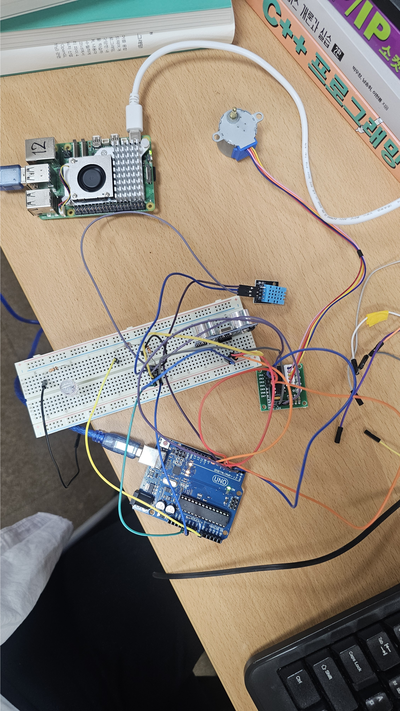

# arduino_ros2
아두이노_ros2

### 1. 프로젝트 개요

- 명칭: ROS2 기반 스마트 환경인지 자동 게이트 시스템

- 핵심 기능: 1. 초음파 센서를 통한 장애물 감지 및 자동 개폐.

- 2. 온습도(DHT11) 및 조도(CdS) 센서를 활용한 실시간 환경 모니터링.

- 3. ROS2 통신을 이용한 하드웨어(아두이노)와 소프트웨어(라즈베리 파이)의 분산 제어.

### 2. 소프트웨어 구성 (터미널 2개 설명)

- 터미널 ①: ultrasonic_node.py (통신 브릿지)

- 역할: 아두이노와 보드레이트로 시리얼 통신을 수행합니다.

- 기능: 아두이노가 쏜 거리,온도,습도,조도 데이터를 파싱(Parsing)하여 ROS2 시스템에 뿌려줍니다.

- 아두이노의 로우 데이터를 ROS2 토픽으로 변환하는 데이터 관문 역할을 합니다."

- 터미널 ②: controller_node.py (메인 컨트롤러)

- 역할: distance 토픽을 구독(Subscribe)하여 모터 동작을 결정합니다.

- 기능: 거리값이 10cm 미만이면 OPEN, 멀어지면 CLOSE 명령을 발행합니다.

- 설명 포인트: "수집된 데이터를 바탕으로 실시간 의사결정을 내리는 시스템의 두뇌입니다."

### 3. 하드웨어 구성 (회로 설명)

- 회로도 특징: 조도 센서(CdS)에 전압 분배 법칙을 적용하여 아날로그 전압 신호를 생성하고, 아두이노 A0 핀으로 읽어옵니다.

- 입력: 초음파 센서, DHT11(온습도), CdS(조도).

- 출력: 28BYJ-48 스테퍼 모터 (게이트 구동).